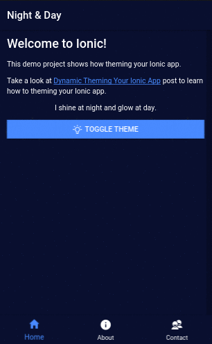

# Ionic Theming Example

This sample repo shows how to theming your Ionic app. It's based on the post [Dynamic Theming Your Ionic App](https://devdactic.com/dynamic-theming-ionic/) By Simon Grimm.

## Prerequisites

Install [Node.js and npm](https://nodejs.org/en/) if they are not already installed on your computer.

> Verify that you are running at least node v6.x.x and npm 3.x.x by running node -v and npm -v in a terminal / console window. Older versions may produce errors.

Install [Ionic](http://ionicframework.com/) if it is not already installed on your computer.

## Steps

- Clone this repo into a new project folder if it's not already done.

 ```bash
 $ git clone https://github.com/datencia/ionic-theming-example.git
 ```

- Install the npm packages described in the `package.json` and verify that it works:

 ```bash
 $ npm install
 ```
- Execute the example:

 ```bash
 $ ionic serve
 ```

- Then, load http://localhost:8100/ in a browser to see the output.

 
